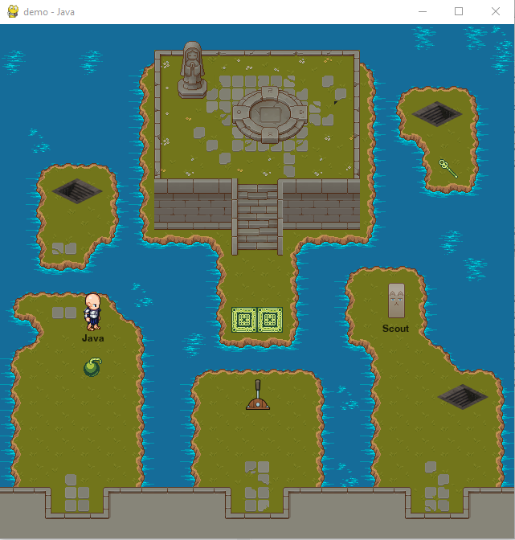
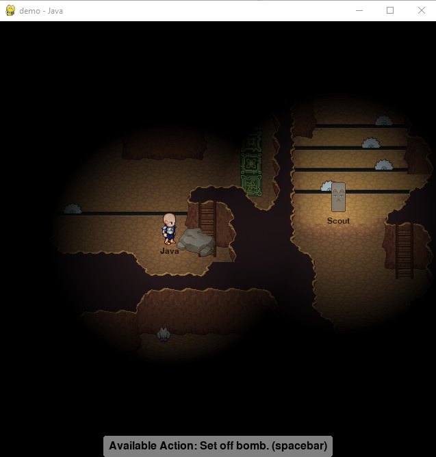

[ **ABOUT** | [SETUP and RUN](SETUP.md) | [CREATE A GAME](CREATE.md) | [TUTORIALS](TUTORIALS.md) | [CONTRIBUTING](CONTRIBUTING.md) ]

# LAN-Caster - About

LAN-Caster is a simple game engine for game development. Key features of LAN-Caster are:

  * Implemented in Python 3;
  * Support for importing 2D Orthogonal tile maps created with [Tiled](http://mapeditor.org);
  * Multiplayer support over Local Area Network (LAN) and experimental support for playing over internet;
  * Extendable classes for client and server that implement game logic, network messaging, rendering and user input handling;
  * Extensive code level comments;
  * Demo Game and Game Engine Tester which demonstrate how to use and extend LAN-Caster to make your own game;
  * Tutorial Videos which explain most aspects of LAN-Caster (Coming Soon).

## Examples From Demo Game

